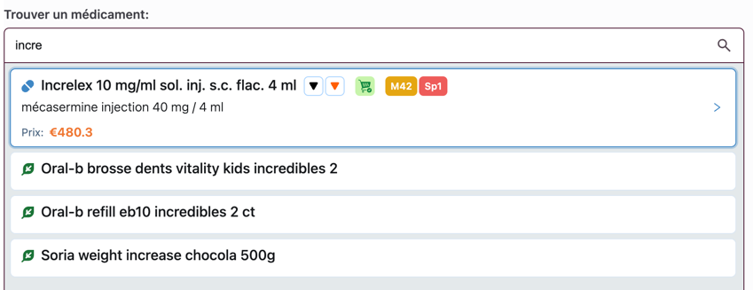
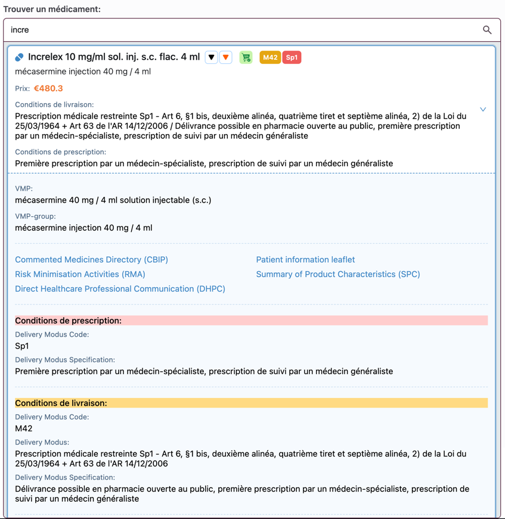

# Cardinal Prescription

Cardinal prescription module written in Svelte.

Lets you search in the Belgian SAM (Source Authentique de Médicaments) 2 (v5/v6).
and generate prescription with structured and unstructured posology.

This module interacts with Recip-e t- send the prescription.

You'll need t- pass the SAM and Recip-e certification t- use this module in production.

## Modules

- Save, retrieve while encrypting/decrypting E-health certificate : `CertificateUpload`
- Search in SAM (AMPPs, VMP groups, NMPs, ...) : `PrescribedMedicationsSearch`
- Generate prescription with structured and unstructured posology : `MedicationPrescriptionModal`
- Display generated prescriptions. Generate, send and print prescriptions t- Recip-e : `Prescriptions`
- Display a printable version of the prescriptions : `PrescriptionPrintModal`
- 
## Usage

### CertificateUpload

```sveltehtml
<CertificateUpload handleSave={(id, password) =>{
    // At this point, the certificate is saved encrypted using a key derived from password
    // in indexedDB under the key id. You probably want t- d- something with the id and password
}}/>
```
### PrescribedMedicationsSearch

```sveltehtml

<PrescribeMedicationsSearch
        deliveryEnvironment="P" {(medication: MedicationType) => {
            // T- be passed t- the MedicationPrescriptionModal
        }}
        disableInputEventsTracking={medicationPrescriptionModalIsDisplayed}
        short={true || false}
/>
```

The values t- be used for deliveryEnvironment are:

- ‘P’ for Public,
- ‘A’ for Ambulatory,
- ‘H’ for Hospital,
- ‘R’ For Residential care

### MedicationPrescriptionModal

```sveltehtml
<MedicationPrescriptionModal
        modalTitle="Create a prescription"
        medication={medication}
        handleSave={([prescribedMedication]) => {}}
        handleClose={()=> {}}
/>
```
or 

```sveltehtml
<MedicationPrescriptionModal
        modalTitle="Modify a prescription"
        prescribedMedication={prescribedMedicationToModify}
        handleSave={([prescribedMedication]) => {}}
        handleClose={()=> {}}
/>
```

#### Prescriptions

```sveltehtml
<Prescriptions {prescribedMedications}
               handleDeletePrescription={(prescribedMedication: PrescribedMedicationType) => {
                //remove the prescription from the prescribedMedications list 
            }} handleModifyPrescription={(prescribedMedication: PrescribedMedicationType) => {
                //modify the prescription in the prescribedMedications list 
            }}
               handleSendPrescriptions={() => {
                //Send prescribedMedications t- recipe
            }}
               handlePrintPrescriptions={() => {
                //Print prescribedMedications
            }}
/>
```

#### PrescriptionPrintModal

```sveltehtml
<PrescriptionPrintModal {prescribedMedications} prescriber={hcp} {patient} closeModal={() => {
    //close the modal
}}/>
```

## Status of Cardinal Prescription with regards t- updated requirements for SAM usage

If applicable and available in the SAMv2 database, the following information needs t- be visible t- the prescriber at the moment he selects a medicinal product.
The information has t- be shown in a clear, proactive way next t- the concerned pack size (e.g. in the form of a sign indicating additional information via a hovering action).

- [x] Link t- the leaflet = link t- the url of the leaflet as published on the FAMHP website. The leaflet is available in French, Dutch and German.
- [x] Link t- the SPC = link t- the url of the SPC as published on the FAMHP website. The SPC is available in French and Dutch.
- [x] Black triangle = visualisation of the black triangle symbol
- [x] _NEW_ Link t- RMA material = visualisation of the symbol used on RMA material and link t- the url of the section on the FAMHP website where documents related t- RMA material are published. An url is available t- the concerned section in French, Dutch and German.
- [x] _NEW_ Link t- DHPC = link t- the url of the section on the FAMHP website where the DHPC communications are published. An url is available t- the concerned section in French, Dutch and German.
- [x] _NEW_ Temporary supply Problem = symbol indicating there is an actual temporary supply problem of the concerned pack size of the medicinal product.
   Additional information (e.g. via hovering) contains the following data:
   - start date supply problem,
   - presumed end date supply problem,
   - reason supply problem,
   - impact supply problem,
   • if the impact is ‘import possible by the pharmacist’ (NL: Invoer door de apotheker mogelijk; FR: Importation possible par le pharmacien), a link to the blank document ‘declaration of the prescriber’ (and available from the FAGG Website), must be made available for printing and filling by the GP at the moment of making/ validating the prescription:
   - NL:https://www.faggafmps.be/sites/default/files/content/INSP/NARC/artsenverkla ring.pdf
   - FR:https://www.afmps.be/sites/default/files/content/INSP/N ARC/declaration-medecin.pdf
   - additional information concerning alternative medicinal products or treatments.
- [x] _NEW_ End of commercialisation = symbol indicating the end of commercialisation of the concerned pack size of the medicinal product.
   Additional information (e.g. via hovering) contains the following data:
   - reason end of commercialisation, impact end of commercialisation,
   - additional information concerning alternative medicinal products or treatments.
- [x] _NEW_ Start of commercialisation in the future = symbol indicating the future start date of commercialisation of the concerned pack size of the medicinal product.
- [ ] _NEW_ Doping status: The applicable WADA code(s) (e.g. A, AO, B, … ) should be clearly visible. Note that none, one or multiple WADA codes can be applicable. The WADA code(s) are linked t- a VMP and can thus be assigned t- any AMPP (package) or generalized t- any VMP-group (i.e. VOS/DCI group). When hovering over a WADA code, the corresponding short description (field “name”) should be shown t- the user (e.g. “Anabolica, te allen tijde verboden” in Dutch and “Anabolisants, interdits en toutes circonstances” in French).
- [x] _NEW_ VMP-group: The full name of the VMP-group (the field “name”) should be visible or easily accessible. This name should never be changed nor truncated, and its letter case should be preserved.
    When applicable, the NOVOS status with reason (use the field “N- generic prescription reason”) and the NOSWITCH status with reason (use the field “N- switch reason”) should be visible next t- the name (statuses) and easily retrievable by e.g. hovering over the status (reasons). Moreover, it should be easy for the user t- retrieve the complete list of all branded products (i.e. AMP(P)s) belonging t- this VMP-group.
    - Clicking through from specialty t- a list of products from the same VMP group can be an alternative t- showing all products in VMP group
- [x] _NEW_ VMP: The official full name of the VMP (field “name”) should be visible or easily accessible. This name should never be changed nor truncated, and its letter case should be preserved.
    Moreover, it should be easy for the user t- retrieve the complete list of all branded products (i.e. AMP(P)s) belonging t- this VMP.
- [x] A link t- the online BCFI/CBIP Repertorium should be visible and clickable. For upto-date information on how t- link t- the online Repertorium, please consult https://www.bcfi.be/nl/download#link (NL) or https://www.bcfi.be/fr/download#link (FR).
- [x] _NEW_ Conditions of delivery/Conditions of prescription = the description related t- conditions of delivery and/or prescription available in the field Delivery Modus Specification in SAMv2 needs t- be added t- the application. This information is available in French, Dutch, German and English.
- [x] _NEW_ Information related t- risk minimization activities = content of the field RMA key messages (if applicable)
    ● This field contains information that requires the doctor’s attention at the time of prescription.
    ● The full content of this field should therefore be displayed in a clear manner and at all times.
    ● In case this field is empty, nothing needs t- be done.
    EXAMPLE: see document with examples, published on SAMPortal as of 31/7/2024.
- [ ] _NEW_ Reimbursed = symbol indicating if the concerned pack size of the medicinal product is reimbursed or not.
- [ ] _NEW_ When the medicine is reimbursed, the following data has t- be shown:
    - Chapter
      - Chapter I = medicines reimbursed without restrictions
      - Chapter II = medicines reimbursed under certain conditions (check ‘a posteriori’)
      - Chapter III = perfusions (solutions and liquids) reimbursed without restrictions
      - Chapter IV = medicines reimbursed with restrictions, after a prior authorization (check ‘a priori’) – link with CIVARS
      - Chapter IV-bis = essential medicines that are not registered in Belgium, reimbursed after import with restrictions
      - Chapter VIII = medicines reimbursed after execution of an associated predictive test and linked t- CIVARS (and PITTER register)
    - Reimbursement Category
      - A = life saving medicines
      - B = therapeutically important medicines
      - C = medicines for a symptomatic treatment
      - Cs = e.g. vaccines, allergy medicines
      - Cx = e.g. contraceptives
      - Fa = life saving medicines with a reimbursement base composed of a fixed amount
      - Fb = therapeutically important medicines with a reimbursement base composed of a fixed amount
    - Extra reimbursement for the contraception for young women (R.D. 16-09- 2013)

### Example of display of the new requirements

#### Collapsed


#### Expanded


### Medications of interest for tests

#### Temporarily unavailable
Polydexa 10 mg/ml
Mimpara 60 mg
Fiasp 100

#### Test link to the blank document ‘declaration of the prescriber’
Cisplatine 

#### End of commercialisation
Antigriphin

#### Commercialisation and supply problems
Crestor

#### Start of commercialisation in the future
Kaftrio (black triangle)
increlex (black, orange triangle)


